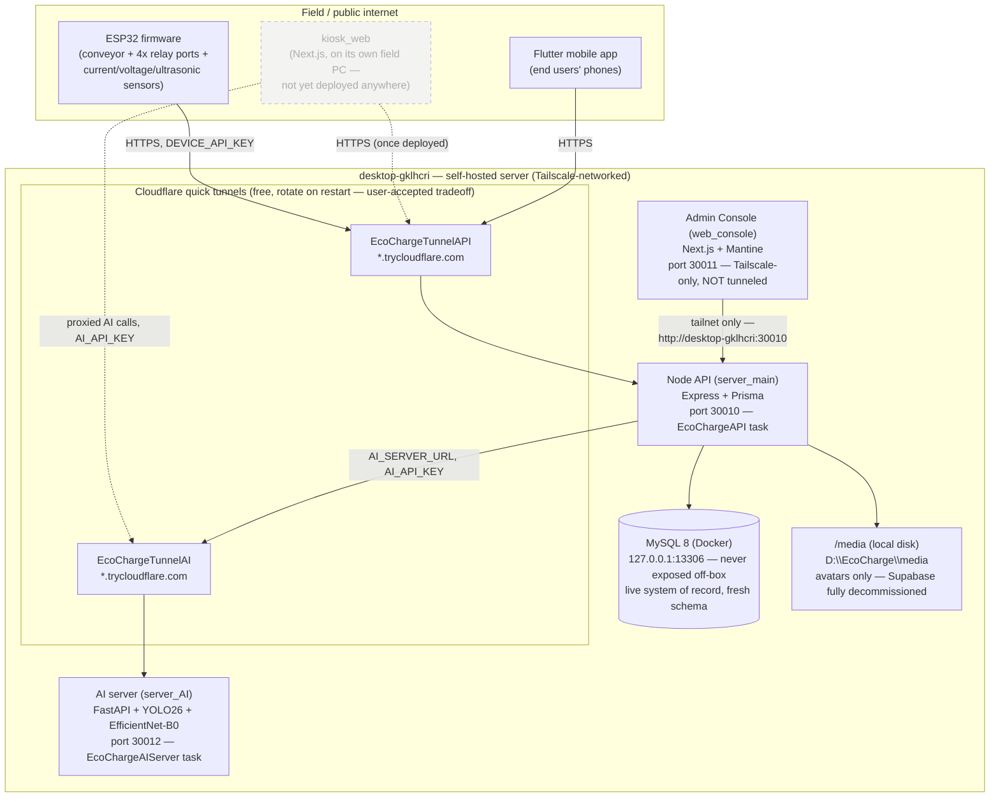

# EcoCharge — System Architecture

Part of the thesis evidence pack (`docs/planning/08-master-checklist.md` Phase H). Reflects the real, live, self-hosted topology as of 2026-08-11 — every box here is either actually deployed and verified reachable this session, or explicitly marked as not yet deployed. Not an aspirational diagram.

## Notes that matter, not just decoration

- **Two different free Cloudflare quick tunnels** (API, AI server) — chosen over a named tunnel + owned domain after the user was told plainly that Cloudflare itself has no free *stable* hostname option (see `memory.md`, 2026-08-11). Both URLs rotate on restart; the ESP32/Flutter app have the current URL compiled in with the rotation risk explicitly accepted (`memory.md`, same date).
- **The admin console is deliberately not tunneled** — Tailscale-only, per the original team-only design rationale. It reaches the API via the tailnet hostname, not the public tunnel.
- **MySQL is never reachable off-box**, by design — bound to `127.0.0.1:13306` only. The API is the only thing that talks to it, and the API only runs on this same machine.
- **Media storage is a local folder on this same box**, not a separate service. Supabase (cloud and a self-hosted Docker instance that was actually built and torn down again the same week) is fully gone — see `docs/planning/03-revamp-master.md` §1.4.
- **`kiosk_web` is dashed/not-yet-deployed** — it belongs on its own field PC (never co-located with the server, per `03-revamp-master.md` §1.1), and that PC hasn't been provisioned yet. Everything else in this diagram is live and was verified reachable this session (`curl`/`Invoke-WebRequest` against real running instances, not assumed).
- **All three self-hosted services (API, AI server, admin console) run as Windows Task-Scheduler-launched processes** with a crash-restart loop — not a real service manager (NSSM/PM2 are both absent from this machine, checked directly). Verified stable under a real restart cycle, not independently verified across an actual machine reboot.
