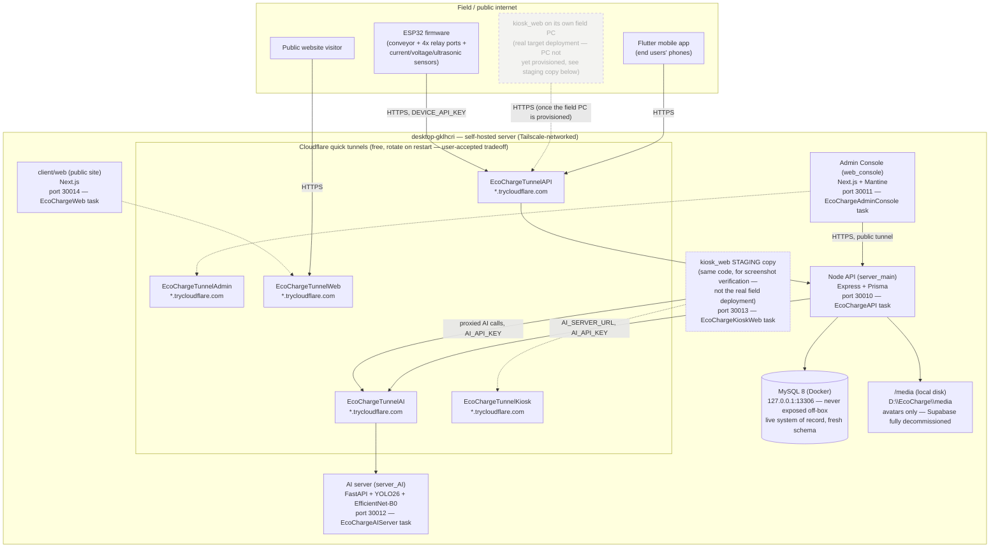

# EcoCharge — System Architecture

Part of the thesis evidence pack (`docs/planning/08-master-checklist.md` Phase H). Reflects the real, live, self-hosted topology as of 2026-08-11 (4th session) — every box here is either actually deployed and verified reachable this session, or explicitly marked with what's still pending. Not an aspirational diagram. **Corrected this session**: the previous version of this diagram was already stale on two counts — it showed the admin console as Tailscale-only (reversed to public earlier the same day) and `kiosk_web` as entirely undeployed (a real staging copy now runs alongside the other services, distinct from its eventual real field-PC deployment).

## Notes that matter, not just decoration

- **Five separate free Cloudflare quick tunnels now** (API, AI server, admin console, kiosk-web staging, public website) — chosen over a named tunnel + owned domain after the user was told plainly that Cloudflare itself has no free *stable* hostname option (see `memory.md`, 2026-08-11). All rotate on restart; the ESP32/Flutter app have the current API URL compiled in with the rotation risk explicitly accepted (`memory.md`, same date).
- **The admin console is public now, not Tailscale-only — reversed 2026-08-11, before this diagram's own prior version was even written**, after the user was asked explicitly and chose to make it public. A real login-rate-limiting gap was found and fixed first (`memory.md`). It still also remains reachable over the tailnet directly, but the tunnel is the primary path now.
- **`kiosk_web`'s real target is still its own field PC, not this server** — that hasn't changed, and that PC still isn't provisioned (dashed `FieldKiosk` box). What's new this session: a **staging copy of the same code** now runs on `desktop-gklhcri:30013` with its own tunnel, specifically so the Kiosk Web design/UX work could be screenshot-verified against a real running instance without waiting on field hardware. Don't confuse the two — the staging copy is a verification convenience, not the real deployment topology.
- **The public website (`client/web`) is now deployed too** (`desktop-gklhcri:30014`), previously not shown in this diagram at all because it didn't exist as a deployable build yet.
- **MySQL is never reachable off-box**, by design — bound to `127.0.0.1:13306` only. The API is the only thing that talks to it, and the API only runs on this same machine.
- **Media storage is a local folder on this same box**, not a separate service. Supabase (cloud and a self-hosted Docker instance that was actually built and torn down again the same week) is fully gone — see `docs/planning/03-revamp-master.md` §1.4.
- **All five self-hosted services run as Windows Task-Scheduler-launched processes** with a crash-restart loop — not a real service manager (NSSM/PM2 are both absent from this machine, checked directly). Verified stable under a real restart cycle, not independently verified across an actual machine reboot.
