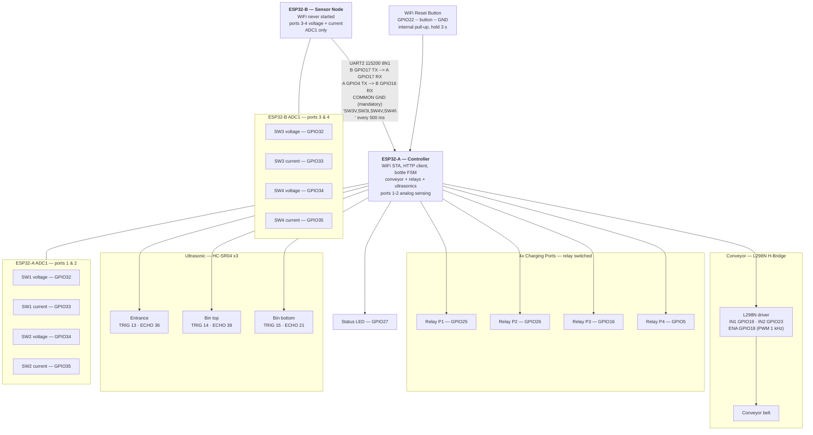

# EcoCharge — Hardware Wiring Diagram

Part of the thesis evidence pack (`docs/planning/08-master-checklist.md` Phase H). Sourced directly from the real pin maps in `esp/ecocharge/include/config.h` (ESP32-A) and `esp/esp32_sensor/src/main.c` (ESP32-B) — not redrawn from memory or from the thesis paper's description. Both firmwares **compile clean** against these definitions (verified 2026-08-20).

> **Hardware revision 3.0.0 — 2026-08-20.** The Raspberry Pi Pico co-processor has been **removed** and replaced by a **second ESP32**. Two boards, one part number, one toolchain. See "Why two ESP32s" below for the real engineering reason — it is not a cosmetic swap, it fixes a measurement that never worked.
>
> **Not independently verified against the physical hardware** — the kiosk is not accessible (see `memory.md`). This is a correct transcription of what the firmware declares, which is the next best thing to an as-built diagram until someone with the physical kiosk confirms it.

---

## Why two ESP32s instead of ESP32 + Pico

The old design had a genuine problem hiding in it, and the revision exists to fix it rather than to tidy the parts list.

Four charging ports each need **two** analog channels (voltage and current) — **eight channels total**. A single ESP32 cannot supply eight usable analog inputs:

- **ADC2 is unusable whenever WiFi is on.** The ADC2 block shares hardware with the WiFi radio; reading it while connected returns garbage and can disturb the RF path. The kiosk is *always* WiFi-connected, so ADC2 is permanently off the table.
- **ADC1 realistically gives six** channels on a standard dev board (GPIO32–36, 39), and two of those (GPIO36/39, input-only) are the natural home for ultrasonic ECHO lines.

The previous build worked around the shortage by putting **SW4's current sensor on ADC2 (GPIO12)** and pushing the rest to a Pico. Consequences that were real, not theoretical:

| Old problem | Consequence |
|---|---|
| SW4 current sat on ADC2 with WiFi active | **Port 4 current always read 0.00 A — its overcurrent protection never worked.** The firmware even documented this ("SW4 current is not measured; it always reports 0"). |
| GPIO12 is the **MTDI strapping pin** | It must be LOW at boot or the chip selects the wrong internal flash voltage. Hanging a sensor circuit on it is a latent boot-failure risk at every power-on. |
| Two architectures, two toolchains | ESP-IDF for the ESP32, Arduino-for-Pico for the co-processor — two build systems, two spare parts, two sets of debugging habits. |

**Splitting the eight channels across two ESP32s puts every channel on an ADC1.** Nothing lands on ADC2, GPIO12 is now unused, and **port 4 overcurrent protection works for the first time**.

| Board | Role | WiFi | Analog channels |
|---|---|---|---|
| **ESP32-A** "Controller" | Conveyor, 4 relays, 3 ultrasonics, WiFi/HTTP, bottle FSM, WiFi reset button | **ON** (STA) | SW1 V+I, SW2 V+I — ADC1 |
| **ESP32-B** "Sensor Node" | Reads ports 3 & 4, streams raw counts to A over UART2 | **never started** | SW3 V+I, SW4 V+I — ADC1 |

ESP32-B keeps its radio off entirely, so it has no ADC2 conflict either — and all four of its channels fit on ADC1 regardless.

---

## System diagram



---

## ESP32-A — Controller pin map

| GPIO | Direction | Connects to | Notes |
|---|---|---|---|
| 19 | OUT | L298N IN1 | conveyor direction A |
| 23 | OUT | L298N IN2 | conveyor direction B |
| 18 | OUT (PWM) | L298N ENA | LEDC ch0, 1 kHz, 8-bit |
| 25 | OUT | Relay port 1 | **active LOW** |
| 26 | OUT | Relay port 2 | active LOW |
| 16 | OUT | Relay port 3 | active LOW |
| 5 | OUT | Relay port 4 | active LOW |
| 13 | OUT | HC-SR04 entrance TRIG | 10 µs pulse |
| 36 | **IN only** | HC-SR04 entrance ECHO | via divider |
| 14 | OUT | HC-SR04 bin-top TRIG | |
| 39 | **IN only** | HC-SR04 bin-top ECHO | via divider |
| 15 | OUT | HC-SR04 bin-bottom TRIG | |
| 21 | IN | HC-SR04 bin-bottom ECHO | via divider |
| 32 | AIN (ADC1_CH4) | SW1 voltage sensor | |
| 33 | AIN (ADC1_CH5) | SW1 current sensor | ACS712-class, 100 mV/A |
| 34 | AIN (ADC1_CH6) | SW2 voltage sensor | **new in rev 3** (was Pico GP26) |
| 35 | AIN (ADC1_CH7) | SW2 current sensor | **new in rev 3** (was Pico GP27) |
| 17 | IN (UART2 RX) | ESP32-B GPIO17 (TX) | sensor stream in |
| 4 | OUT (UART2 TX) | ESP32-B GPIO16 (RX) | reserved for future commands |
| **22** | **IN, pull-up** | **WiFi reset button → GND** | **new in rev 3** |
| 27 | OUT | Status LED | |
| ~~12~~ | — | **now unused** | was SW4 current on ADC2 — removed; MTDI strapping pin |

> **All HC-SR04 ECHO lines need a 5 V → 3.3 V divider** (1 kΩ series + 2 kΩ to GND). The HC-SR04 drives ECHO at 5 V and the ESP32's pins are **not** 5 V tolerant — connecting directly will damage the pin over time. TRIG is fine driven at 3.3 V.

## ESP32-B — Sensor Node pin map

| GPIO | Direction | Connects to | Notes |
|---|---|---|---|
| 32 | AIN (ADC1_CH4) | SW3 voltage sensor | |
| 33 | AIN (ADC1_CH5) | SW3 current sensor | |
| 34 | AIN (ADC1_CH6) | SW4 voltage sensor | |
| 35 | AIN (ADC1_CH7) | SW4 current sensor | **measured for the first time in rev 3** |
| 17 | OUT (UART2 TX) | ESP32-A GPIO17 (RX) | sensor stream out |
| 16 | IN (UART2 RX) | ESP32-A GPIO4 (TX) | reserved |
| GND | — | **ESP32-A GND** | **mandatory common ground** |

Deliberately identical analog pin choices to ESP32-A's ports 1–2, so a technician learns one pattern and both boards are wired the same way.

---

## WiFi reset button — wiring and behaviour

**The simplest circuit in the kiosk: two wires and a button.**

```
   ESP32-A GPIO22 ──────┬────── [ momentary push-button ] ────── GND
                        │
                    (optional)
                     100 nF
                        │
                       GND
```

- **No external resistor.** The firmware enables the ESP32's internal pull-up, so the pin idles HIGH and the button pulls it LOW.
- **The 100 nF capacitor is optional** — recommended only if the button is panel-mounted on a long cable run inside a cabinet full of switching relays, where it suppresses contact bounce and induced noise. The firmware debounces in software regardless.
- **Any momentary NO (normally-open) push-button works.** No latching switch — a latching switch held closed would look like a permanently-held button.

**Why GPIO22 specifically:** it is the only free pin on ESP32-A that is *not* a strapping pin. GPIO0, 2, 12 and 15 all influence boot mode or flash voltage at power-on, so a button on any of them that happened to be pressed during a power cut could stop the kiosk booting entirely. GPIO22 has no boot-time role.

**Behaviour** (`esp/ecocharge/src/wifi_reset.c`):

| Action | Result |
|---|---|
| Tap, or hold < 3 s | Nothing. Counter resets on release; a log line records the cancelled attempt. |
| **Hold ≥ 3 s** | WiFi credentials erased from NVS → reboot → kiosk comes up in its **provisioning AP** so a phone can join it and set a new network. |
| Held down at power-on | **Ignored until released once.** A physically stuck button would otherwise wipe credentials on every boot — which presents as "the kiosk keeps forgetting its WiFi" and is miserable to diagnose. |
| NVS erase fails | Logs the error and **does not reboot** — rebooting would drop the kiosk offline for nothing and destroy the log line explaining why. |

Serial console prints one line per second while held, so a technician can watch the countdown rather than guess whether the button is even wired correctly.

**Why this button had to exist.** Before rev 3 the provisioning AP was only reachable when the stored credentials *failed*. A kiosk holding perfectly valid credentials for a network that had merely been **renamed, or whose password had rotated**, would connect-fail-retry forever with no way in — the only fix was to physically retrieve the unit and reflash it. This button is the field escape hatch.

---

## UART link protocol

ESP32-B → ESP32-A, one ASCII line every 500 ms:

```
"<SW3V>,<SW3I>,<SW4V>,<SW4I>\n"      e.g.  "1234,2048,3100,1980\n"
```

- Values are **raw 12-bit ADC counts** (0–4095), not converted units.
- **The conversion constants live only on ESP32-A** (`VOLTAGE_SCALE`, `CURRENT_SENSOR_SENSITIVITY`, `CURRENT_SENSOR_VOFFSET`). Recalibrating the sensors therefore means reflashing **one** board, not two.
- ESP32-B averages 8 reads per channel before sending; ESP32-A additionally requires an overcurrent condition to persist for `CURRENT_OVERCURRENT_HOLD_MS` before tripping a relay. A single noisy sample can never cut power to a charging phone.
- If any channel fails to read, B **skips the whole line** rather than sending a negative or partial value — A then keeps its last known reading.
- Four values, not the Pico's three. A parser expecting exactly four integers rejects a stale three-field line outright, so a half-upgraded bench (new A, old Pico still attached) fails loudly instead of silently mis-assigning ports.

---

## Two-microcontroller architecture — for the thesis write-up

This remains a **two-microcontroller system**, and that is worth stating explicitly in the paper, because it is a genuine design decision rather than an accident:

> A single ESP32 cannot provide eight trustworthy analog inputs while maintaining a WiFi connection, because its second ADC block is disabled by the radio. Rather than accept an unmonitored charging port — the earlier revision left port 4's current permanently unread — the sensing load is divided across two identical ESP32 modules: a controller that owns all actuation and networking, and a sensor node whose radio is never started. The node streams raw ADC counts over a serial link, and the controller owns all calibration. This keeps every measurement on a WiFi-safe ADC, restores overcurrent protection on all four ports, and reduces the bill of materials to a single microcontroller part number.

The paper's original hardware list (which names an ESP32 and a servo) already diverges from the built system in other ways — see `docs/planning/10-paper-vs-repo-gap.md`, which tracks the conveyor-vs-servo substitution and the backend stack divergence as decisions to document rather than defects to fix.
