# EcoCharge — Hardware Wiring Diagram

Part of the thesis evidence pack (`docs/planning/08-master-checklist.md` Phase H). Sourced directly from the real pin map in `esp/ecocharge/include/config.h` — not redrawn from memory or the thesis paper's description. **Not independently verified against the physical hardware** — no hardware access this session (see `memory.md`); this is a correct transcription of what the firmware source declares, which is the next best thing to an as-built diagram until someone with the physical kiosk can confirm it matches.

```mermaid
flowchart TB
    ESP32["ESP32\n(main controller — WiFi, HTTP client, FSM)"]
    Pico["Raspberry Pi Pico\n(co-processor — voltage sensing for ports 2 & 4,\nsince the ESP32's ADC2 is unavailable while WiFi is active)"]

    subgraph motor["Conveyor — L298N H-Bridge"]
        L298N["L298N driver"]
        Belt["Conveyor belt"]
    end

    subgraph ports["4x Charging Ports"]
        R1["Relay — Port 1\nGPIO25"]
        R2["Relay — Port 2\nGPIO26"]
        R3["Relay — Port 3\nGPIO16"]
        R4["Relay — Port 4\nGPIO5"]
    end

    subgraph sensing["Current/Voltage sensing"]
        C1["Current sense — Port 1\nADC1 ch5 (GPIO33)"]
        C3["Current sense — Port 3\nADC1 ch7 (GPIO35)"]
        C4["Current sense — Port 4\nADC2 ch5 (GPIO12)"]
        V1["Voltage sense — Port 1\nADC1 ch4 (GPIO32)"]
        V3["Voltage sense — Port 3\nADC1 ch6 (GPIO34)"]
    end

    subgraph ultrasonic["3x HC-SR04 Ultrasonic (5V->3.3V divider on ECHO)"]
        US_E["Entrance\nTRIG GPIO13 / ECHO GPIO36"]
        US_BT["Bin-top\nTRIG GPIO14 / ECHO GPIO39"]
        US_BB["Bin-bottom\nTRIG GPIO15 / ECHO GPIO21"]
    end

    LED["Status LED\nGPIO27"]

    ESP32 -- "IN1 GPIO19 / IN2 GPIO23 / ENA GPIO18 (PWM)" --> L298N
    L298N --> Belt

    ESP32 --> R1
    ESP32 --> R2
    ESP32 --> R3
    ESP32 --> R4

    ESP32 --> C1
    ESP32 --> C3
    ESP32 --> C4
    ESP32 --> V1
    ESP32 --> V3

    ESP32 -- "UART2: RX GPIO17 / TX GPIO4 @ 115200 baud" --> Pico
    Pico -. "Port 2 & 4 voltage data" .-> ESP32

    ESP32 --> US_E
    ESP32 --> US_BT
    ESP32 --> US_BB

    ESP32 --> LED
```

## Notes that matter, not just decoration

- **This is a two-microcontroller system, not one.** The ESP32 is the main controller (WiFi, HTTP client to the API server, the bottle/charging FSMs), but a separate Raspberry Pi Pico handles voltage sensing for ports 2 and 4 specifically, communicating back over UART2 (`PICO_UART_RX_GPIO`/`PICO_UART_TX_GPIO`, 115200 baud). The reason is a real ESP32 hardware constraint stated directly in the firmware comment: **ADC2 is unavailable while WiFi is active**, and port 4's current sensing already needs ADC2 — this asymmetry (ports 1/3 sensed directly by the ESP32's ADC1, ports 2/4 partially offloaded to the Pico) is a deliberate workaround, not an inconsistency.
- **Relay active level is LOW** (`RELAY_ACTIVE_LEVEL = 0`) — a relay module wired active-low, common for opto-isolated relay boards; worth stating explicitly since it inverts the intuitive "GPIO high = on" assumption.
- **Ultrasonic ECHO lines need a voltage divider** (1kΩ + 2kΩ per the firmware comment) since the HC-SR04's 5V ECHO signal would exceed the ESP32's 3.3V-tolerant GPIO input otherwise — a real, easy-to-miss wiring detail, not optional.
- **GPIO36 and GPIO39 are deliberately used for two of the three ECHO lines** — both are input-only pins on the ESP32, which the firmware comment notes is intentional (no PWM/output capability needed there anyway).
- **Overcurrent protection is software, not hardware-fused**: `CURRENT_OVERCURRENT_AMPS = 15.0f`, held for `CURRENT_OVERCURRENT_HOLD_MS = 2000` before the safety task (priority 10, the highest in the system per `config.h`'s own priority ladder) trips the relay off. This diagram shows the sensing wiring; the trip logic itself lives in firmware, not a physical fuse — worth stating plainly as a real design characteristic, not an oversight, when this diagram is used in the thesis defense.

## What this diagram does not show

- Physical connector types, wire gauges, or a PCB/breadboard layout — this is a logical signal-connection diagram (which GPIO goes where), not a fabrication drawing.
- Power supply wiring (5V/3.3V rails, the L298N's separate motor-voltage supply) — the pin map in `config.h` doesn't specify this, and it wasn't verifiable without the physical hardware.
