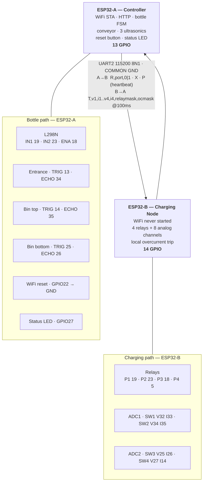

# EcoCharge — Hardware Wiring Diagram

Part of the thesis evidence pack (`docs/planning/08-master-checklist.md` Phase H). Transcribed directly from the real pin maps in `esp/ecocharge/include/config.h` (ESP32-A) and `esp/esp32_sensor/src/main.c` (ESP32-B). **Both firmwares compile clean** — verified 2026-08-25.

> **Hardware revision 4.0.0 — 2026-08-25.** Two changes from rev 3, both forced by real constraints rather than preference:
>
> 1. **GPIO36 and GPIO39 do not exist on the boards actually in use.** Rev 3 put two ultrasonic ECHO lines there. They moved to **GPIO34/35**, which are also input-only — the property that made 36/39 the right pick is preserved.
> 2. **The two boards were badly unbalanced.** Rev 3 gave ESP32-A eleven jobs and ESP32-B four ADC reads. Rev 4 splits by **subsystem**: A owns the bottle path and networking, B owns charging entirely.
>
> **Not verified against physical hardware** — both boards were disconnected when this revision was built. Firmware compiles and is ready to flash; nothing has been probed.

---

## Why the split is what it is

Four charging ports each need voltage **and** current — **eight analog channels**. That number drives the whole design.

| Constraint | Consequence |
|---|---|
| GPIO36–39 absent on these boards | **ADC1 offers only four usable channels**: 32, 33, 34, 35 |
| ADC2 is unusable while WiFi is active | A board with a radio can never supply the other four |
| ESP32-B never starts its radio | **B is the only board that can use ADC2** |

So all eight channels must live on B — there is nowhere else for them. Once they do, the relays should follow: **the overcurrent trip belongs on the same microcontroller as the relay it cuts**, so protection never waits on a serial link.

| Board | Owns | WiFi | GPIO |
|---|---|---|---|
| **ESP32-A** "Controller" | WiFi/TLS/HTTP, bottle FSM, conveyor, 3 ultrasonics, reset button, LED | **ON** | **13** |
| **ESP32-B** "Charging Node" | 4 relays + all 8 analog channels, local overcurrent trip | **never started** | **14** |

Rev 3 was 21 pins vs 6. Rev 4 is 13 vs 14 — and A still carries the heavier *compute* (TLS, HTTP, FSM), which is the honest way to read "even".

---

## System diagram



---

## ESP32-A — Controller (13 pins)

| GPIO | Dir | Connects to | Notes |
|---|---|---|---|
| 19 | OUT | L298N **IN1** | conveyor direction A |
| 23 | OUT | L298N **IN2** | conveyor direction B |
| 18 | OUT PWM | L298N **ENA** | LEDC ch0, 1 kHz, 8-bit |
| 13 | OUT | Ultrasonic **entrance TRIG** | 10 µs pulse |
| **34** | **IN only** | Ultrasonic **entrance ECHO** | **was GPIO36** — needs divider |
| 14 | OUT | Ultrasonic **bin-top TRIG** | |
| **35** | **IN only** | Ultrasonic **bin-top ECHO** | **was GPIO39** — needs divider |
| 25 | OUT | Ultrasonic **bin-bottom TRIG** | |
| 26 | IN | Ultrasonic **bin-bottom ECHO** | needs divider |
| 22 | IN pull-up | **WiFi reset button → GND** | hold 3 s |
| 27 | OUT | Status LED | |
| 17 | UART2 RX | ← ESP32-B GPIO17 (TX) | telemetry in |
| 4 | UART2 TX | → ESP32-B GPIO16 (RX) | relay commands out |

**No analog inputs and no relays on this board any more.**

## ESP32-B — Charging Node (14 pins)

| GPIO | Dir | Connects to | ADC |
|---|---|---|---|
| 19 | OUT | Relay **port 1** | — **active LOW** |
| 23 | OUT | Relay **port 2** | — |
| 18 | OUT | Relay **port 3** | — |
| 5 | OUT | Relay **port 4** | — |
| 32 | AIN | **SW1 voltage** | ADC1_CH4 |
| 33 | AIN | **SW1 current** | ADC1_CH5 |
| 34 | AIN | **SW2 voltage** | ADC1_CH6 |
| 35 | AIN | **SW2 current** | ADC1_CH7 |
| 25 | AIN | **SW3 voltage** | ADC2_CH8 |
| 26 | AIN | **SW3 current** | ADC2_CH9 |
| 27 | AIN | **SW4 voltage** | ADC2_CH7 |
| 14 | AIN | **SW4 current** | ADC2_CH6 |
| 17 | UART2 TX | → ESP32-A GPIO17 (RX) | — |
| 16 | UART2 RX | ← ESP32-A GPIO4 (TX) | — |
| **GND** | — | **→ ESP32-A GND** | **mandatory** |

> **The ADC2 channels only work because this firmware never calls `esp_wifi_init()`.** If WiFi is ever added to ESP32-B, ports 3 and 4 silently start reading garbage. That constraint is written at the top of `esp32_sensor/src/main.c` where someone adding WiFi would see it.

---

## The three wires between the boards

```
ESP32-B GPIO17 (TX) ─────────────► ESP32-A GPIO17 (RX)
ESP32-B GPIO16 (RX) ◄───────────── ESP32-A GPIO4  (TX)
ESP32-B GND        ◄────────────►  ESP32-A GND
```

**Common ground is mandatory.** Without it the UART reads garbage or nothing at all, and it is the single most common failure when bringing up a two-board bench.

### Protocol

**B → A**, every 100 ms (matches A's FSM tick, so bin-confirmation re-sampling lines up exactly):

```
T,<v1>,<i1>,<v2>,<i2>,<v3>,<i3>,<v4>,<i4>,<relaymask>,<ocmask>
```

Eight raw 12-bit ADC counts, then two bitmasks (bit0 = port 1 … bit3 = port 4): which relays are closed, and which have tripped. **Raw counts, not volts and amps** — A owns the calibration constants, so recalibrating means reflashing one board.

**A → B**, on demand:

| Command | Meaning |
|---|---|
| `R,<port>,<0\|1>` | set one relay, port 1–4 |
| `X` | all relays off |
| `P` | heartbeat — the controller is alive |

### Three independent safety layers

1. **Local overcurrent trip on B** — raw count ≥ 3908 (the 15 A equivalent) held for 2 s cuts that relay. No serial link involved. A tripped port refuses to re-close until explicitly switched off and on again, so a server retry loop cannot re-energise a genuine fault every few seconds.
2. **Link-loss watchdog on B** — if A goes quiet for 5 s, B cuts every relay itself. **A dead or unplugged controller cannot leave mains switched on.** A sends its heartbeat from the *safety task*, so it stops precisely when the safety loop stops, not merely when the network drops.
3. **Independent max-on ceiling on B** — 1 hour per port, regardless of what A asked for.

A still tracks the server-issued duration and switches ports off normally; these three are what happens when that fails.

---

## WiFi reset button

```
   ESP32-A GPIO22 ──────┬────── [ momentary NO button ] ────── GND
                        │
                    (optional)
                     100 nF
                        │
                       GND
```

No external resistor — internal pull-up. **Hold 3 s** → WiFi credentials erased from NVS → reboot into the provisioning AP. A tap does nothing. Held at power-on it is ignored until released once, so a stuck button cannot wipe credentials on every boot. A failed NVS erase logs and does **not** reboot.

**GPIO22 is the only free non-strapping pin on ESP32-A.** GPIO0/2/12/15 all influence boot mode or flash voltage, so a button on any of them held during a power cut could stop the kiosk booting.

Must be **momentary** — a latching switch left closed reads as permanently held.

---

## Every ECHO line needs a divider

HC-SR04 drives ECHO at **5 V**; ESP32 pins are **not** 5 V tolerant.

```
ECHO ──[ 1kΩ ]──┬── ESP32 GPIO
                │
             [ 2kΩ ]
                │
               GND
```

TRIG is fine driven at 3.3 V. GPIO34/35 are input-only, which is exactly why they carry two of the three ECHO lines.

---

## For the thesis write-up

> A single ESP32 cannot provide eight trustworthy analog inputs while maintaining a WiFi connection: its second ADC block is disabled by the radio, and on the boards used here the first offers only four usable channels. Rather than accept an unmonitored charging port, the system divides across two identical ESP32 modules by subsystem — a controller owning the bottle-detection path and all networking, and a charging node whose radio is never started, owning the four relays and all eight analog channels. Because the relays and the current sensors that protect them sit on the same microcontroller, the overcurrent trip executes without depending on the serial link; the charging node additionally de-energises every relay if the controller stops signalling. This keeps all measurements on a WiFi-safe ADC, gives all four ports working overcurrent protection, and reduces the bill of materials to a single microcontroller part number.

The conveyor-vs-servo substitution and the Node-vs-Flask backend divergence are tracked in `docs/planning/10-paper-vs-repo-gap.md` as decisions to document rather than defects to fix.
